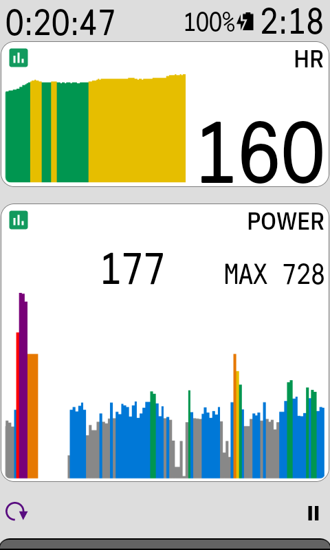

# Power Graph

A [Karoo](https://www.hammerhead.io/) extension that adds scrolling bar graph data fields for power and heart rate. Each graph shows the last two minutes alongside the current value, colored by your training zones.

## Data fields

- **Power**: power, with your ride max on larger fields
- **HR**: heart rate

Built with [karoo-ext](https://github.com/hammerheadnav/karoo-ext).
